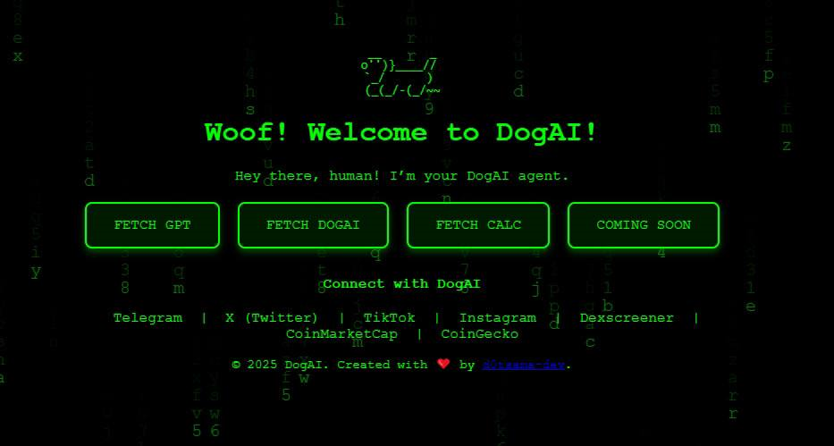

# DogAI Roadmap

> **The Intelligent Companion for DeFi**  
Combining the power of AI and blockchain to provide fun, interactive, and innovative tools for the Solana ecosystem.

---

### **Badges**

---

### **Tech Stack**

---

## **Overview**
DogAI combines the power of AI and blockchain to provide fun, interactive, and innovative tools. This roadmap outlines the milestones achieved and the vision for future development.

---

## **Phase 0: Foundation and Early Development (Q4 2024)**

### Objectives
- Build the core utilities: FetchGPT, FetchDOGAI (Faucet), and FetchCalc.
- Establish DogAI's brand and community presence.

### Completed Tasks
#### FetchGPT
- ✅ Created chatbot interface with dynamic OpenAI GPT-3.5 API integration.
- ✅ Added predefined prompts for quick and engaging user interactions.
- ✅ Integrated playful ASCII animations for a unique experience.

#### FetchDOGAI (Faucet)
- ✅ Developed the DogAI faucet to distribute tokens securely using Solana blockchain.
- ✅ Implemented anti-bot measures and a cooldown period.
- ✅ Integrated RPC services to fetch token account details and handle transactions.

#### FetchCalc
- ✅ Designed a utility to predict future token prices using the DCA model.
- ✅ Integrated API for real-time SOL and DOGAI prices.
- ✅ Implemented a projection model using constant product formulas.

#### Brand and Community
- ✅ Secured the domain: **[dogai.gdn](https://dogai.gdn)**.
- ✅ Implemented X account automation for @dogai_gg to post AI-driven updates and engagement content.
- ✅ Established social media presence: Telegram, Twitter (X), TikTok, and Instagram.
- ✅ Published documentation for all utilities on the DogAI website.

---

## **Phase 1: Stabilization, Refinement & V2 Features (Q1–Q2 2025)**

### Goals
- Enhance the stability and performance of core tools.
- Introduce impactful V2 features.
- Expand community engagement with Telegram bot integration.

### Planned Tasks
- [ ] **Enhanced Chat Persistence**
- [ ] **Enhanced FetchCalc**:
     - Add Daily Prediction option.
- [ ] **FetchDOGAI Enhancements**:
    - Update logic to create token account where an address have no DogAI tokens
- [ ] **Telegram Integration**:
  - **Core Bot Integration**:  
    - Implement basic commands like `/start` and `/help` to provide group-specific information and FAQs.  
  - **FetchGPT Integration**:  
    - Allow users to query FetchGPT directly within Telegram.  
    - Provide inline and private query responses.  
  - **Community Engagement**:  
    - Use polls, quizzes, and leaderboards to encourage participation.  
    - Add gamification with token rewards for active members.  
  - **FetchDOGAI Integration**:  
    - Enable `/claim <wallet>` commands for FetchDogAI claims.
  - **FetchCalc Integration**:  
    - `/predict <token>`: Provide token price predictions.
    - `/dca <daily_amount> <days>`: Calculate DCA projections.
    - `/calc <token> <amount>`: Perform custom token calculations.
  - **Price Alerts**:  
    - Automate DOGAI token price updates and milestone notifications.
   
---

## **Phase 2: DefAI Development**

### Goals
Build the **Risk Scoring Dashboard** to serve as the first step toward an intelligent DeFi platform.

---

## **Connect with Us**
- **Website**: [dogai.gdn](https://dogai.gdn)
- **GitHub**: [DogAI GitHub](https://github.com/d0tsama-dev)
- **Community**: [Telegram](https://t.me/dogai_gg) | [Twitter](https://x.com/dogai_gg) | [Instagram](https://www.instagram.com/dogai_gg)

---

## **Private Repository**
The source code and detailed development of DogAI are hosted in a private repository. If you are part of the team, visit the private DogAI repo [here](https://github.com/d0tsama-dev/DogAI).
